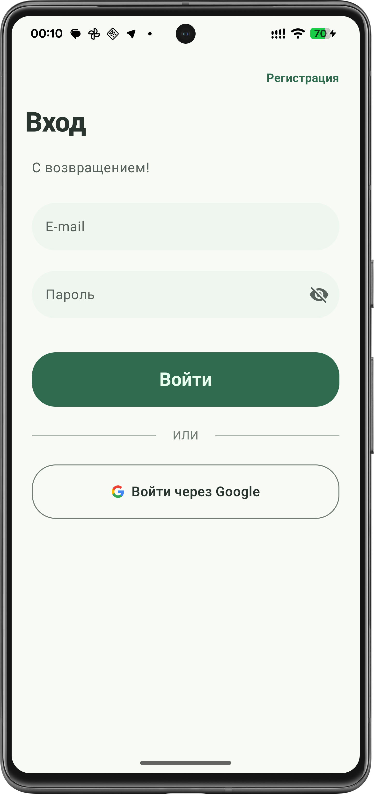
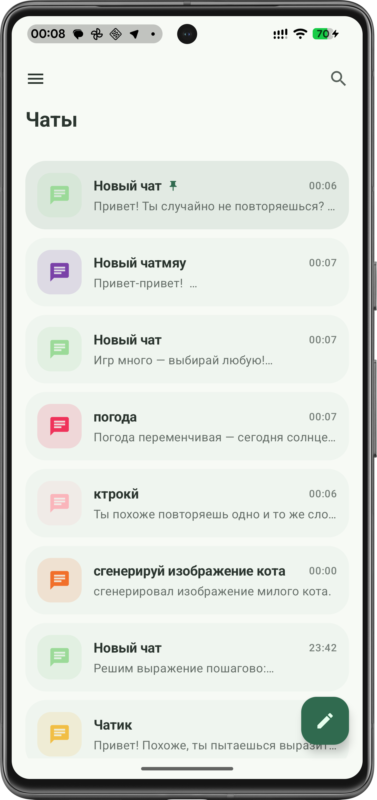
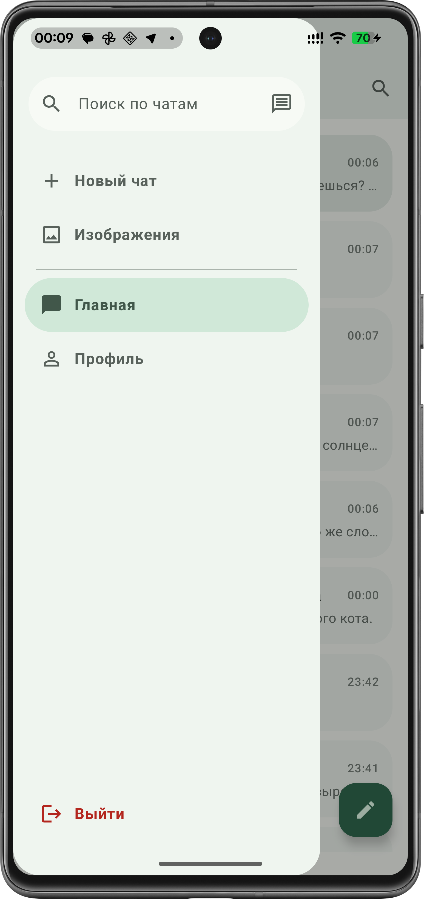
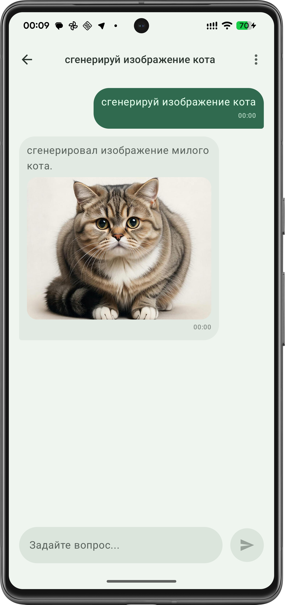
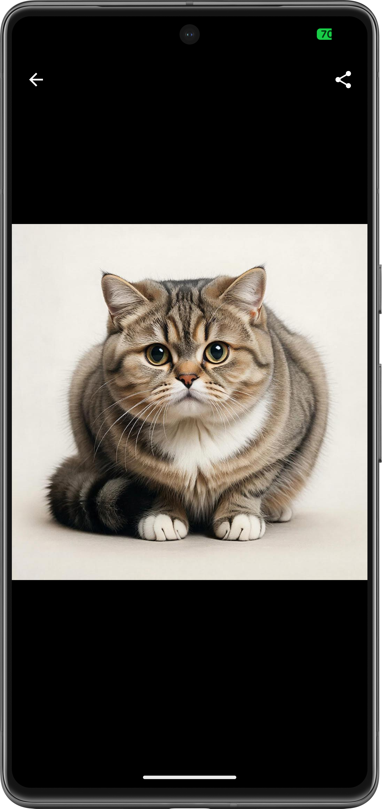
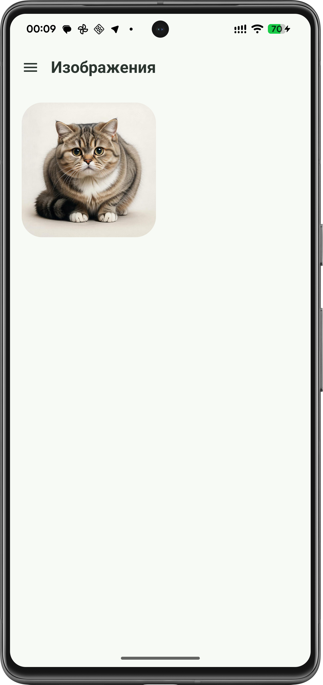
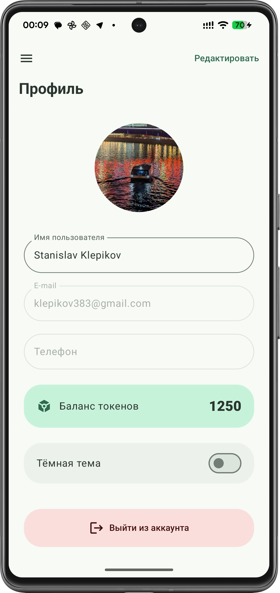

# GigaAvito — AI Assistant (GigaChat API)

**GigaAvito** — мобильное приложение на Kotlin/Compose, разработанное в рамках тестового задания. Это персональный ассистент, который помогает решать повседневные задачи, генерировать текст и изображения, используя мощности GigaChat.

## 📸 Скриншоты

### Авторизация и Главная
| Вход в аккаунт | Список чатов | Боковое меню |
| :---: | :---: | :---: |
|  |  |  |

### Чат и Генерация
| Чат с AI | Просмотр изображения | Галерея генераций |
| :---: | :---: | :---: |
|  |  |  |

### Профиль
| Экран профиля |
| :---: |
|  |

---

## 🚀 Основные возможности

### 🔐 Авторизация
*   **Firebase Auth:** Вход по E-mail/паролю и через Google.
*   **Автологин:** Приложение запоминает пользователя.
*   **Валидация:** Проверка данных на лету и обработка ошибок сети.

### 💬 Интеллектуальный чат
*   **GigaChat API:** Полноценный диалог с нейросетью.
*   **Генерация картинок:** Прямо в чате по текстовому запросу.
*   **Системный Share:** Возможность поделиться текстом или сгенерированным изображением.
*   **Контекстное меню:** Копирование текста и управление сообщениями через Long Press.

### 🗂 Управление данными
*   **Room Database:** Все чаты и сообщения сохраняются локально.
*   **Пагинация:** Список чатов подгружается порциями для экономии ресурсов.
*   **Поиск:** Быстрая фильтрация диалогов по названию.
*   **Pin/Rename:** Возможность закреплять важные чаты и менять их названия.

### 👤 Профиль и Кастомизация
*   **Редактирование:** Смена имени и аватара (Firebase Storage).
*   **Баланс:** Отображение текущих токенов пользователя.
*   **Тёмная тема:** Поддержка динамической смены темы (Light/Dark mode).

---

## 🛠 Технологический стек

*   **UI:** Jetpack Compose, Material 3.
*   **Архитектура:** MVVM, Clean Architecture (Data/Domain/Presentation).
*   **DI:** Koin.
*   **Database:** Room + Paging 3.
*   **Network:** Retrofit 2, OkHttp 4.
*   **Async:** Kotlin Coroutines & Flow.
*   **Images:** Coil 3.
*   **Backend:** Firebase (Auth, Storage).

---

## ⚙️ Настройка проекта

Для запуска проекта локально:

1. Клонируйте репозиторий.
2. Добавьте свой `google-services.json` в папку `app/`.
3. Создайте файл `local.properties` и добавьте туда ваш API-ключ GigaChat:
   ```properties
   GIGACHAT_API_KEY=ваш_ключ